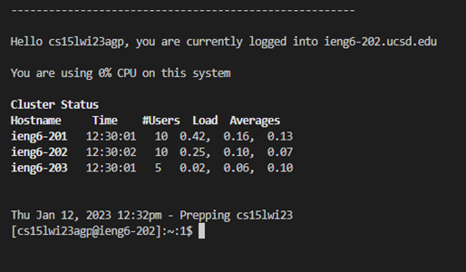

# How to Log Into a Course-Specific Account on ieng6

## Instructions

> Step 1: Installing VScode

1. Go to the Visual Studio Code website: https://code.visualstudio.com/ and follow the steps provided to install the software on the device you're using. Download the right version for your computer's operating system.
2. Once installed, open VScode on the device you're using
3. You should be able to open a window such as the one pictured below:


> Step 2: Remotely Connecting
* The following instructions will show how to use VScode/terminal to connect to a remote server over the internet

1. Make sure that Git is installed for Windows. Go to https://gitforwindows.org/ to download. 
2. Follow the steps on the following post to set your default terminal to use git bash in VScode: https://stackoverflow.com/a/50527994
3. Open the terminal (Ctrl or Command + `, or use the Terminal -> New Terminal menu option). You should see the name of your course-specific account and (if this is your first time connecting to this server) you may see
```
⤇ ssh cs15lwi23zz@ieng6.ucsd.edu
The authenticity of host 'ieng6.ucsd.edu (128.54.70.227)' can't be established.
RSA key fingerprint is SHA256:ksruYwhnYH+sySHnHAtLUHngrPEyZTDl/1x99wUQcec.
Are you sure you want to continue connecting (yes/no/[fingerprint])? 
```
4. Type yes and press enter. Then give your course-specific account password. You should see this message after sharing your password and logging in:

```
# Now on remote server
Last login: Sun Jan  2 14:03:05 2022 from 107-217-10-235.lightspeed.sndgca.sbcglobal.net
quota: No filesystem specified.
Hello cs15lwi23zz, you are currently logged into ieng6-203.ucsd.edu

You are using 0% CPU on this system

Cluster Status 
Hostname     Time    #Users  Load  Averages  
ieng6-201   23:25:01   0  0.08,  0.17,  0.11
ieng6-202   23:25:01   1  0.09,  0.15,  0.11
ieng6-203   23:25:01   1  0.08,  0.15,  0.11

Sun Jan 02, 2022 11:28pm - Prepping cs15lwi23
```
As a picture (specific to you, Stephanie):



Your terminal is now officially connected to a computer in the CSE basement. Your computer is called the "client" and the cse basement computer is known as the "server".


> Step 3: Trying Some Commands
